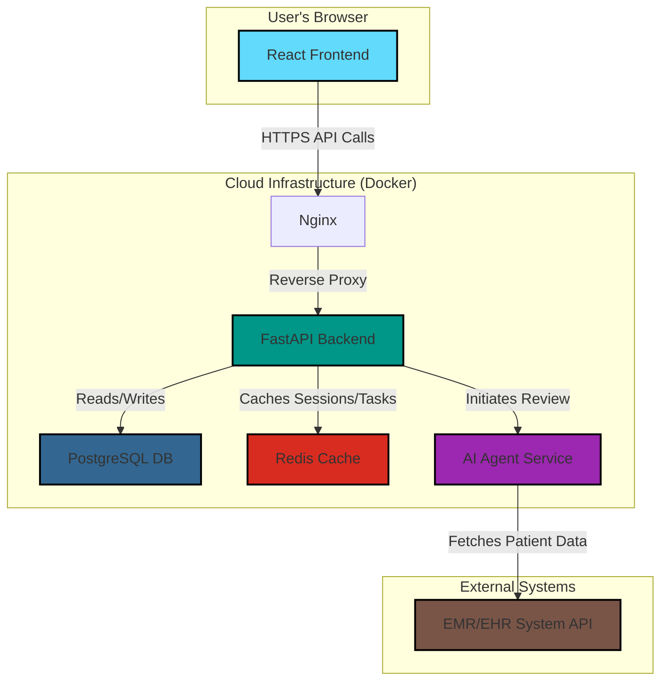

# Architecture Diagram

This diagram illustrates the high-level architecture of the MedRefills AI platform.

### Description

*   **User's Browser**: The clinical staff interacts with our system through a React-based single-page application.
*   **Cloud Infrastructure**: All our backend services are containerized using Docker for consistency and scalability.
    *   **Nginx**: Acts as a reverse proxy, directing traffic to the appropriate backend service.
    *   **FastAPI Backend**: The core of our application, handling business logic, API requests, and database interactions.
    *   **PostgreSQL DB**: Our primary database for storing all persistent data like patient info, refill requests, and user accounts.
    *   **Redis Cache**: Used for caching frequently accessed data and managing background tasks to ensure a speedy user experience.
    *   **AI Agent Service**: A dedicated service that runs our AI agents to review refill requests.
*   **External Systems**: We connect to external Electronic Medical Record (EMR) systems to fetch patient data.
