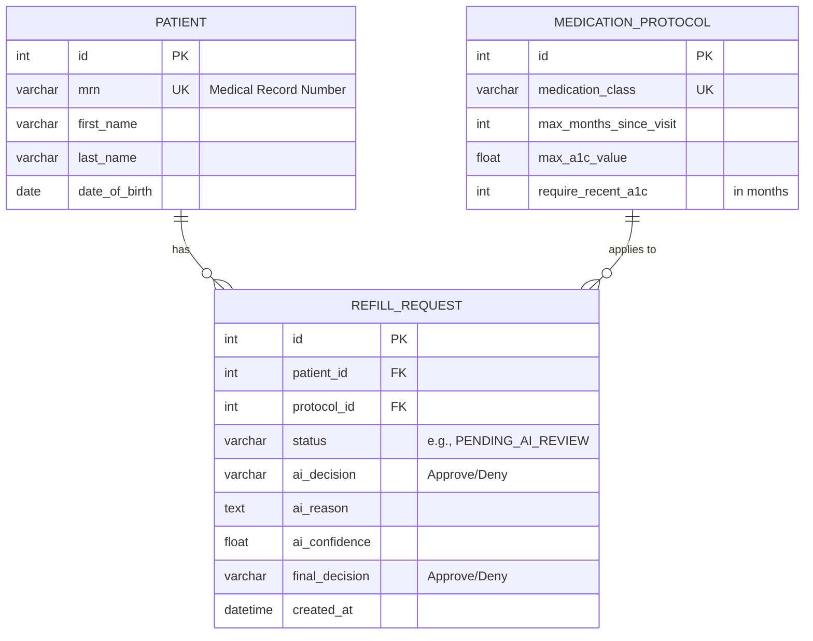

# Entity-Relationship (ER) Diagram

This diagram outlines the schema of our PostgreSQL database.

### Entities

*   **PATIENT**: Stores information about the patients.
    *   `mrn` is a unique key to identify patients.
*   **MEDICATION_PROTOCOL**: Defines the rules for different classes of medications.
    *   `medication_class` is a unique key.
*   **REFILL_REQUEST**: The central table that links patients to medication protocols for a specific refill request.
    *   It contains foreign keys (`FK`) to the `PATIENT` and `MEDICATION_PROTOCOL` tables.
    *   It stores the state of the request, the AI's analysis, and the final human decision.
