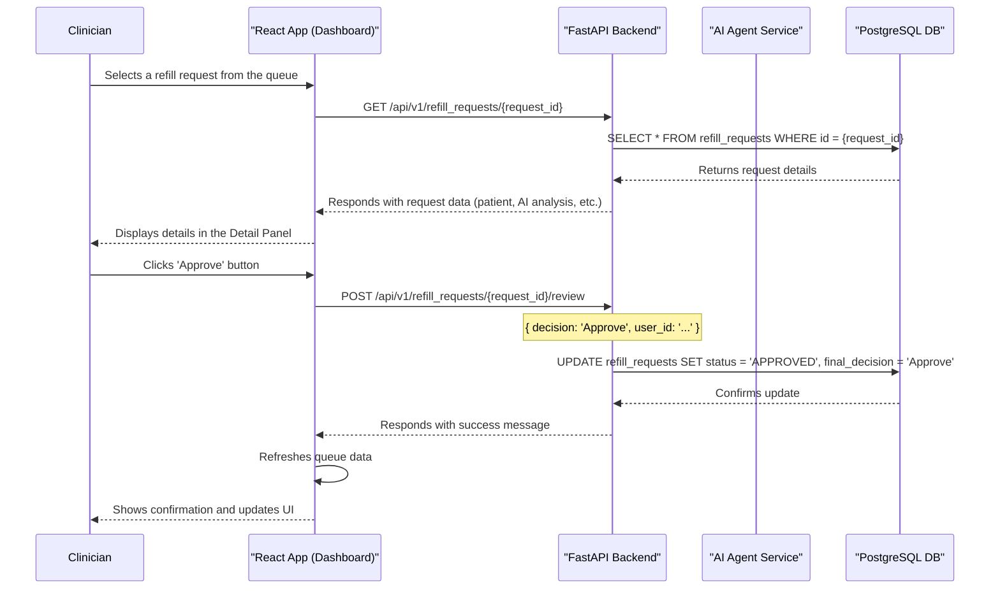

# Sequence Diagram: Refill Request Review

This diagram shows the sequence of interactions when a clinician reviews a refill request.

### Flow Description

1.  **Selection**: The clinician clicks on a request in the dashboard's queue.
2.  **Data Fetch**: The React app sends an API request to the FastAPI backend to get the full details for that request.
3.  **Database Query**: The backend queries the PostgreSQL database for the requested information.
4.  **Display**: The data is returned and displayed in the UI's detail panel.
5.  **Decision**: The clinician makes a decision and clicks "Approve".
6.  **Action**: The React app sends a `POST` request to the backend to record the decision.
7.  **Update DB**: The backend updates the request's status in the database.
8.  **Confirmation**: The backend confirms the update, and the UI is refreshed to show the new status, providing immediate feedback to the clinician.
