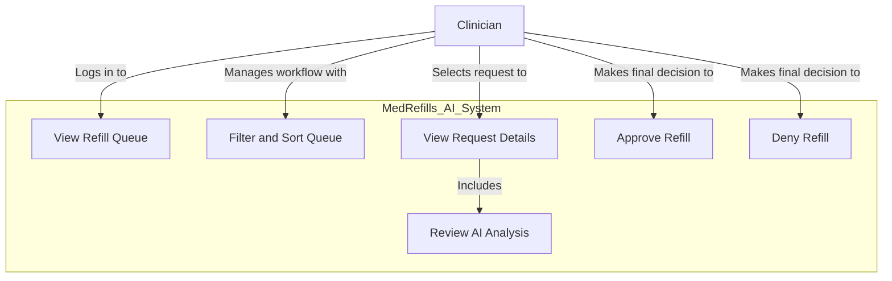

# Use Case Diagram

This diagram shows the key interactions between our users (actors) and the MedRefills AI system.

### Actors

- **Clinician**: A licensed healthcare professional (e.g., nurse, pharmacist, doctor) responsible for reviewing and actioning medication refill requests.

### Use Cases

- **View Refill Queue**: The clinician sees a list of all pending refill requests.
- **Filter and Sort Queue**: The clinician can organize the queue by various criteria like AI decision, patient name, or medication.
- **View Request Details**: The clinician selects a specific request to see all relevant information, including patient data and AI analysis.
- **Review AI Analysis**: As part of viewing details, the clinician examines the AI's recommendation, confidence score, and reasoning.
- **Approve Refill**: The clinician agrees with the refill request and approves it.
- **Deny Refill**: The clinician disagrees with the refill request and denies it.
